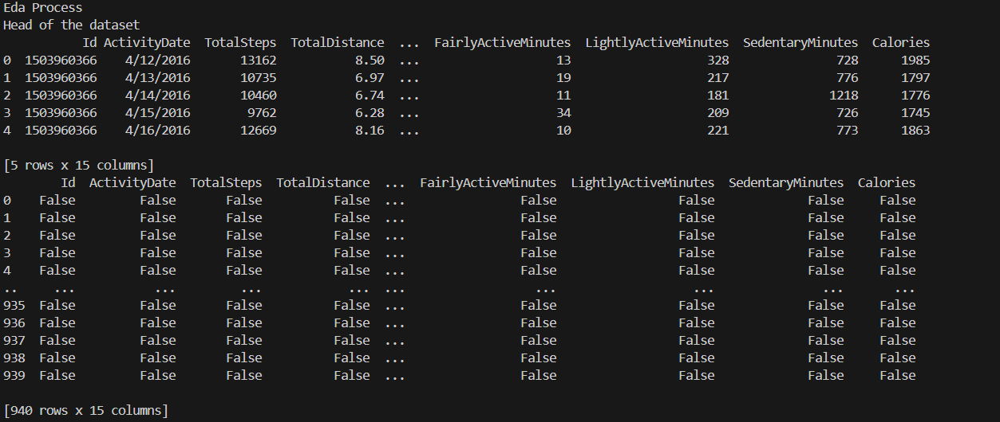
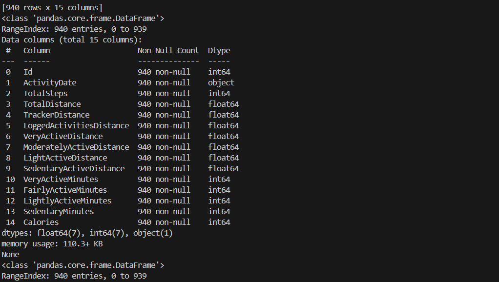
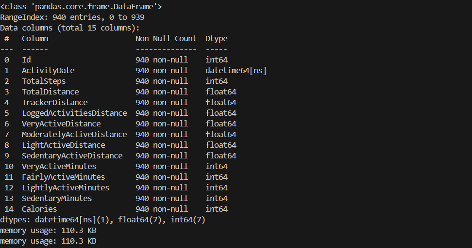
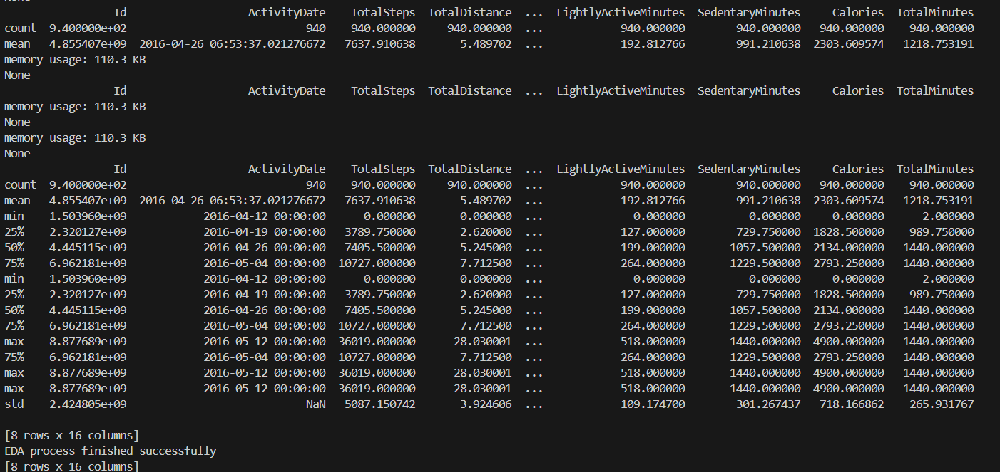
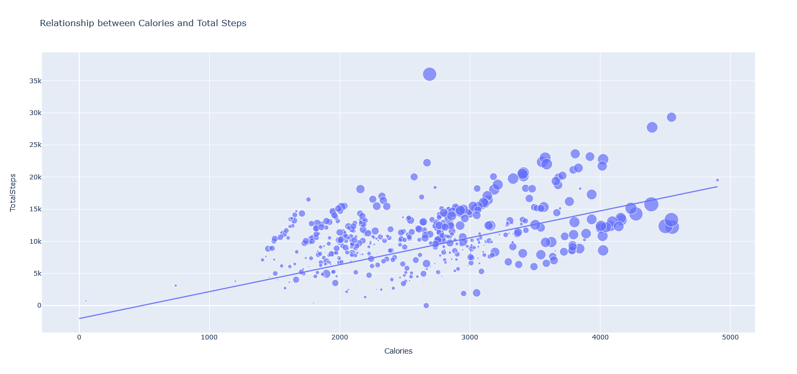
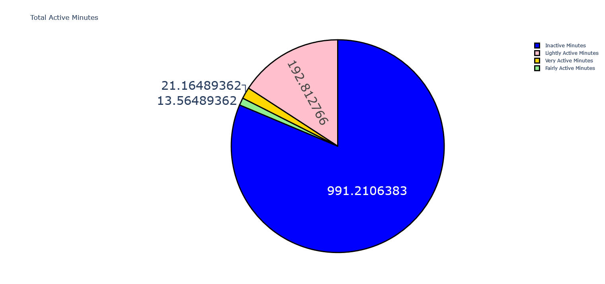
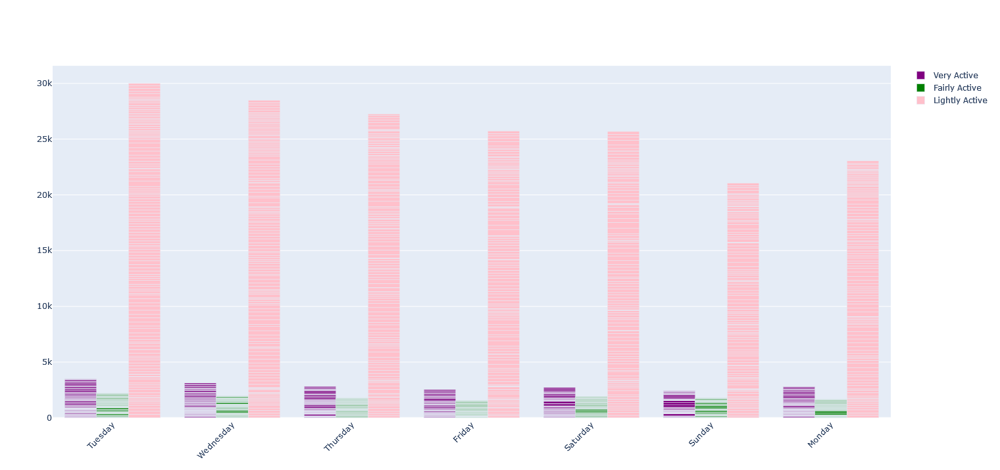
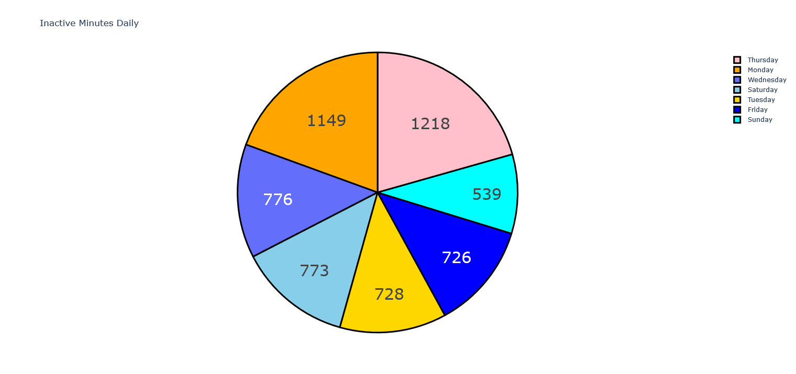
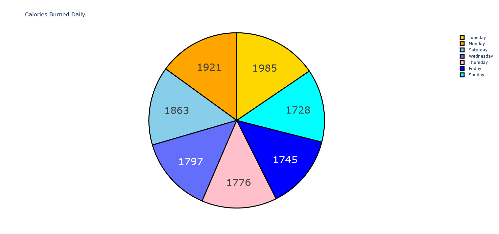

**Smart Watch Data Analysis using Python**
==================================================

**We analyze the days chosen by the public and their performance in the workout.**
-----------------------------------------------------------------------------------
Smartwatches are preferred by people who like to take care of their fitness. With this analysis we can find out which days of the week are chosen by the public to perform their healthy activities and which days are not chosen.

### EDA Process
We check that the data has no null values, convert the date type to ActivityDate, create the TotalMinutes column and display
the descriptive statistics of the dataset.

### Analysis Process
Let's have a look about at the relationship between calories burned and the total steps walked in a day
You can see that there is a linear relationship between the number of the steps and and the number of calories burned in a day

Total Active Minutes

Let’s have a look at the very active, fairly active, and lightly active minutes on each day of the week

Let's have a look at the number of inactive minutes on each day of the week

Let's have a look at the number of the calories burned each day of the week

So this is how you can analyze smartwatch data using the Python programming language. There is a lot more you can do with this dataset. 
You can also use it for predicting the number of calories burned in a day.

**Author**
------------

* Renar Zamora - renarzamora@gmail.com

**Tools**
----------------
* Python 3.11, Visual Studio Code, Matplotlib, Pandas and Plotly.
